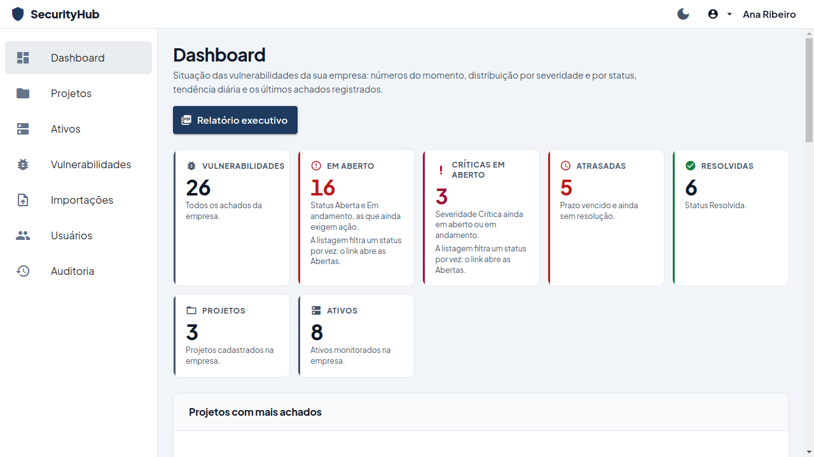
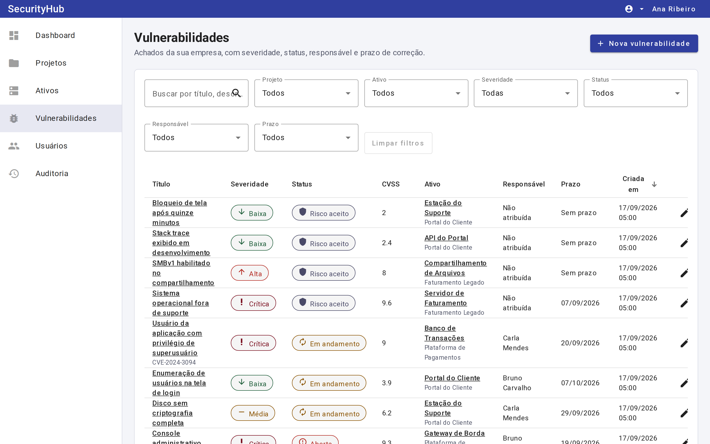
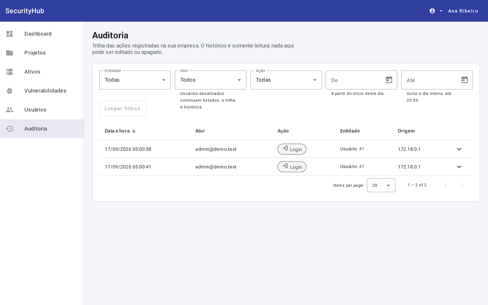
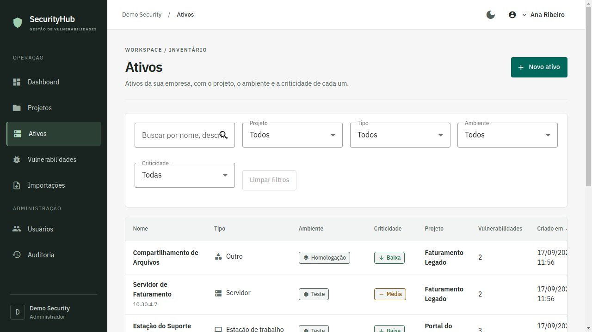
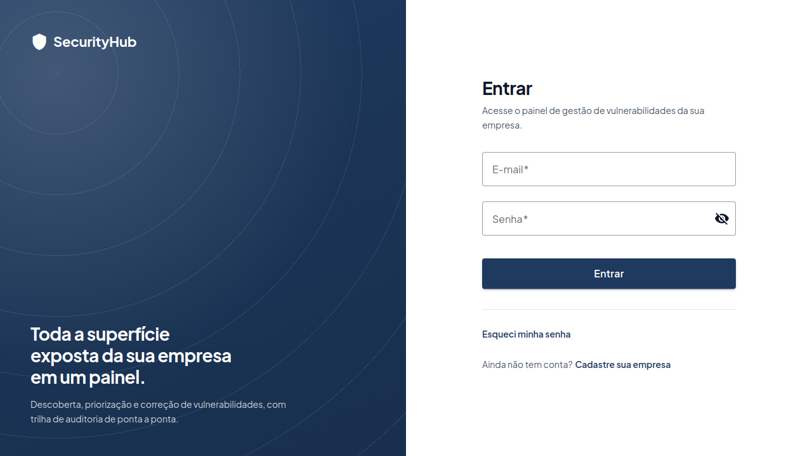

# SecurityHub

Aplicação web para uma equipe de segurança acompanhar vulnerabilidades: você cadastra os
projetos e os ativos da empresa, registra os achados, atribui um responsável e acompanha
até a correção. Cada empresa enxerga apenas os próprios dados, cada papel tem permissões
diferentes, e toda alteração relevante fica registrada numa trilha de auditoria.

Foi construído como projeto de portfólio, então a ideia não era só fazer funcionar, mas
tomar as decisões que um sistema desse tipo exige de verdade: isolamento entre clientes,
autorização que não dependa da interface, e uma trilha que não vaze segredo.



## O que dá para fazer

Depois de registrar a empresa e o primeiro administrador, você organiza o trabalho em
projetos, cadastra os ativos de cada um (uma API, um servidor, um site) e registra as
vulnerabilidades encontradas, com severidade, CVSS, CVE e prazo.

O fluxo do dia a dia é atribuir o achado a alguém, mudar o status conforme o trabalho
anda, discutir nos comentários e resolver. Um desenvolvedor só consegue mexer no status
do que está atribuído a ele; um analista mexe em qualquer um; um leitor não mexe em nada.

O dashboard resume a situação: quantas vulnerabilidades existem, quantas continuam
abertas, quantas passaram do prazo, como se distribuem por severidade e status, e como
isso evoluiu nos últimos 30 dias. A tela de auditoria mostra quem mudou o quê, quando, e
qual era o valor antes.

| | |
| --- | --- |
|  |  |
| Lista de vulnerabilidades com filtros | Auditoria com comparação antes/depois |
|  |  |
| Ativos por projeto, tipo e criticidade | Autenticação |

O layout funciona em desktop e tablet ([mesmo dashboard em 834px](docs/screenshots/dashboard-tablet.png)).

## Rodando

Precisa de Docker e Docker Compose v2.

```bash
git clone https://github.com/coopas/SecurityHub.git
cd SecurityHub
cp .env.example .env
sed -i "s|^SECURITYHUB_JWT_SECRET=.*|SECURITYHUB_JWT_SECRET=$(openssl rand -base64 48)|" .env
docker compose up --build
```

Na primeira vez o build demora alguns minutos, porque compila o backend e o frontend do
zero. Depois disso:

| | |
| --- | --- |
| Aplicação | http://localhost:8081 |
| API | http://localhost:8080/api/v1 |
| Swagger | http://localhost:8080/swagger-ui.html |

Para derrubar tudo e apagar os dados: `docker compose down -v`.

### Entrando

O Compose sobe no perfil `demo`, que popula duas empresas com dados realistas. Todas as
contas usam a senha `Demo@SecurityHub2026`:

| E-mail | Papel |
| --- | --- |
| `admin@demo.test` | Administrador |
| `analyst@demo.test` | Analista |
| `developer@demo.test` | Desenvolvedor |
| `viewer@demo.test` | Leitor |

Entre com cada um para ver as permissões mudando. Existe também
`admin@northwind.test`, de outra empresa: o dashboard dele é completamente diferente, o
que é a forma mais rápida de ver o isolamento funcionando.

Essa senha é pública de propósito, para a demo funcionar sem configuração. Ela protege
dados sintéticos num banco que você acabou de criar na sua máquina. Se for hospedar isso
em algum lugar acessível, defina `SECURITYHUB_DEMO_PASSWORD` no `.env` ou desligue o seed
com `securityhub.demo.seed-enabled: false`. O segredo do JWT nunca é versionado.

## Stack

| | |
| --- | --- |
| Backend | Java 11, Spring Boot 2.7.18, Spring Security 5.7, Spring Data JPA |
| Banco | PostgreSQL 15, migrations com Flyway |
| Frontend | Angular 16 com TypeScript strict, Angular Material, RxJS |
| Testes | JUnit 5, Mockito, Testcontainers, Jasmine/Karma |
| Infra | Docker Compose |

As versões são fixas de propósito. O projeto fica em Java 11 e `javax.*`, sem migrar para
Spring Boot 3, e o motivo está em [`docs/adr/0001`](docs/adr/0001-stack-java-11-spring-boot-2-7.md).

## Algumas decisões

**Recurso de outra empresa responde 404, não 403.** Um 403 confirmaria que o registro
existe, e isso basta para alguém mapear os ids de um concorrente. O `companyId` vem sempre
do token assinado, nunca do corpo ou da query, e é revalidado contra a linha do usuário a
cada requisição.

**A autorização mora no serviço, não no controller nem na tela.** Esconder um botão no
Angular não é controle de acesso. Os testes negativos chamam a API direto com o papel
errado e esperam 403. A regra de posse do desenvolvedor precisa da linha carregada para
ser avaliada, então ela fica no corpo do método, depois da busca que já é escopada por
empresa, para que outra empresa continue recebendo 404.

**A auditoria guarda o tamanho do comentário, não o texto.** O sanitizador mascara por
nome de campo, não por valor. Se alguém colar uma credencial num comentário, o texto iria
íntegro para a trilha e ficaria legível para todo administrador.

**Filtros são montados com a Criteria API.** A forma comum, `:param is null or coluna =
:param`, quebra no PostgreSQL quando o filtro chega vazio, porque ele não infere o tipo de
um parâmetro nulo nessa posição.

**Vulnerabilidade não guarda `project_id`.** Um ativo pode ser movido de projeto, então a
coluna ficaria desatualizada. O projeto é lido pelo ativo, e a listagem já faz esse join
para mostrar o nome.

Mais contexto em [`docs/architecture.md`](docs/architecture.md) e nos
[ADRs](docs/adr/).

## Testes

```bash
cd backend  && ./mvnw verify      # 243 testes
cd frontend && npm ci && npm run lint && npm run test:ci && npm run build   # 300 testes
./scripts/smoke-test.sh           # fluxo completo, com a aplicação no ar
```

Os testes de integração sobem um PostgreSQL 15 de verdade via Testcontainers, então
precisam de um Docker acessível. Nenhum teste usa H2: um banco em memória com dialeto
diferente não provaria que as constraints e os índices parciais funcionam.

O `smoke-test.sh` percorre o caminho inteiro contra a pilha rodando, incluindo cadastro,
login, o fluxo de correção, a auditoria e uma verificação de que uma empresa não alcança
os dados da outra.

Se `./mvnw test` reclamar que não encontrou um ambiente Docker, provavelmente seu usuário
não está no grupo `docker`. Em engines anteriores à 25.0, rode com
`-Ddocker.api.version=1.41` ([o motivo](docs/adr/0005-pin-docker-api-version-for-testcontainers.md)).

## Rodando sem Docker

Precisa de JDK 11, Node 18 (veja `frontend/.nvmrc`) e um PostgreSQL 15.

```bash
cd backend
export SECURITYHUB_JWT_SECRET=$(openssl rand -base64 48)
./mvnw spring-boot:run -Dspring-boot.run.profiles=dev

cd frontend
npm ci && npm start     # porta 4200, com proxy para o backend
```

O Flyway cria o schema na primeira execução contra um banco vazio. As variáveis `DB_HOST`,
`DB_PORT`, `DB_NAME`, `DB_USER` e `DB_PASSWORD` têm padrões de desenvolvimento.

## Documentação

| | |
| --- | --- |
| [`docs/architecture.md`](docs/architecture.md) | Camadas, isolamento entre empresas, auditoria |
| [`docs/data-model.md`](docs/data-model.md) | Diagrama e as decisões de modelagem |
| [`docs/permissions.md`](docs/permissions.md) | Matriz de permissões e onde cada regra é aplicada |
| [`docs/api-examples.md`](docs/api-examples.md) | Requisições e respostas de toda a API |
| [`docs/security-dependencies.md`](docs/security-dependencies.md) | Análise de dependências |
| [`docs/http/`](docs/http/) | Coleções `.http` e Postman |

## O que ainda não tem

Não há refresh token, recuperação de senha nem convite de usuários: o login usa um access
token de vida curta e os usuários são criados no cadastro da empresa. Também não há
exportação, anexos nem importação de relatórios de scanner.

O [`CHANGELOG.md`](CHANGELOG.md) lista o que entrou na 1.0.0 e as limitações conhecidas.

## Licença

MIT, veja [`LICENSE`](LICENSE).
