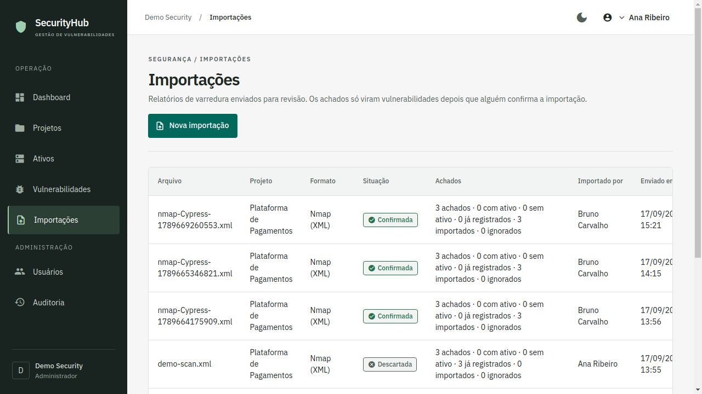
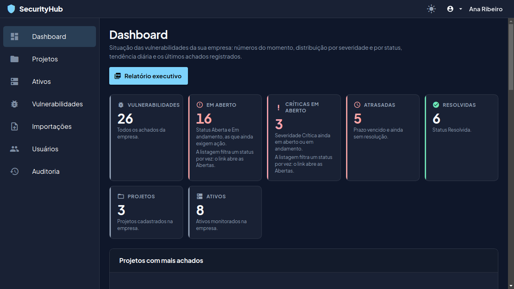

<h1 align="center">SecurityHub</h1>

<p align="center">
  A multi-tenant vulnerability management platform — scanner report import, triage and
  remediation tracking, with an audit trail that does not leak secrets.
</p>

<p align="center">
  <a href="https://github.com/coopas/SecurityHub/actions/workflows/ci.yml"></a>
  <a href="LICENSE"></a>
</p>

## Screenshots

| Dashboard | Vulnerabilities |
| :-------: | :-------------: |
|  |  |

| Scan import | Audit trail |
| :---------: | :---------: |
|  |  |

| Sign in | Dark theme |
| :-----: | :--------: |
|  |  |

The interface is in Portuguese. The layout works on desktop and tablet
([the same dashboard at 834px](docs/screenshots/dashboard-tablet.png)).

## Features

- Projects, assets and vulnerabilities, with severity, CVSS, CVE and due date
- Scanner report import for **Nmap (XML)**, **OWASP ZAP (JSON)** and **Nuclei (JSONL)**,
  reviewed before anything is written and deduplicated by fingerprint across re-imports
- Assignment, status workflow and a comment thread per finding
- File attachments, with the type decided by the bytes rather than by what the client declared
- CSV export honouring the filters on screen, and an executive PDF report
- Dashboard with counts, distribution by severity and status, and a 30-day trend
- Audit trail recording who changed what, when, and what the value was before
- Four roles — administrator, analyst, developer, reader — enforced in the service layer
- Invitations by e-mail, password recovery, and sessions that renew without interrupting work
- Light and dark theme, following the system setting until the user chooses

## Tech stack

Java 11 with Spring Boot 2.7 on the backend, Angular 16 on the frontend, PostgreSQL 15 for
storage. The versions are pinned deliberately — [ADR 0001](docs/adr/0001-stack-java-11-spring-boot-2-7.md)
records why this stays on Java 11 and `javax.*` instead of moving to Spring Boot 3.

| Technology | Used for |
| --- | --- |
| Spring Security 5.7 | Authentication, and `@PreAuthorize` on service methods |
| Spring Data JPA | Persistence, with the Criteria API for dynamic filters |
| Flyway 9.22 | Schema migrations, never edited once applied |
| Angular Material 16 | Component library, themed from the project's own palettes |
| Chart.js | Dashboard distribution and trend charts |
| Testcontainers | A real PostgreSQL 15 for every integration test |
| JUnit 5, Mockito, Jasmine, Cypress | Unit, integration and end-to-end tests |
| OpenPDF | The executive report |
| Docker Compose | Running the whole stack locally |

## Security

**A resource belonging to another company answers 404, never 403.** A 403 would confirm that
the record exists, which is enough to map a competitor's identifiers. The `companyId` always
comes from the signed token, never from the request body or the query string, and it is
revalidated against the user's row on every request.

**Authorization lives in the service layer, not in the controller and not in the screen.**
Hiding a button in Angular is not access control. The negative tests call the API directly
with the wrong role and expect 403. The developer's ownership rule needs the row loaded
before it can be evaluated, so it sits in the method body after the company-scoped lookup,
which is what keeps another company on 404 rather than 403.

**The audit trail stores the length of a comment, not its text.** The sanitiser masks by
field name, not by value. If someone pasted a credential into a comment, the text would reach
the trail intact and be readable by every administrator.

**Refresh tokens are opaque and stored only as a SHA-256 digest**, rotated per family, with
reuse detection: presenting a token twice revokes the whole family. Passwords use BCrypt at
cost 12.

**Uploads are validated by content, not by claim.** The declared content type is ignored and
the format is decided by magic number. CSV export neutralises formula injection and quotes
every cell. The XML parser refuses DTDs and external entities, which closes XXE on the one
format — Nmap — that ships a DOCTYPE.

**Deduplication is a database guarantee, not only a service rule.** A finding is identified by
`sha256(scanner:rule:target:cve)` under a partial unique index on `(company_id, fingerprint)`,
so re-importing a report cannot undo a status, an assignee or a comment a human set.

**What this does not do:** there is no SSO, no MFA, and no rate limiting on authentication
beyond what a reverse proxy would provide. The demo seed ships a public password, documented
below, meant to be changed or disabled before the stack is exposed.

## Project structure

```text
backend/src/main/java/com/securityhub/
├── asset/ attachment/ audit/ auth/     # one package per domain, each with its entity,
├── comment/ company/ dashboard/        # repository, service, controller and DTOs
├── invitation/ project/ report/
├── scan/                               # scanner parsers and the import pipeline
├── user/ vulnerability/
├── security/                           # JWT, filters, the security filter chain
├── config/ mail/ demo/
└── shared/                             # error envelope, pagination, specifications

frontend/src/app/
├── core/                               # guards, interceptors, models, singleton services
├── features/                           # one lazy module per screen group
│   ├── assets/ audit/ auth/ dashboard/
│   ├── errors/ imports/ projects/
│   └── users/ vulnerabilities/
├── layout/                             # authenticated shell: toolbar and sidenav
└── shared/                             # reusable components and the Material imports
```

## Getting started

Requires Docker and Docker Compose v2.

```bash
git clone https://github.com/coopas/SecurityHub.git
cd SecurityHub
cp .env.example .env
sed -i "s|^SECURITYHUB_JWT_SECRET=.*|SECURITYHUB_JWT_SECRET=$(openssl rand -base64 48)|" .env
docker compose up --build
```

The first build takes a few minutes, because it compiles both the backend and the frontend.

| | |
| --- | --- |
| Application | http://localhost:8081 |
| API | http://localhost:8080/api/v1 |
| Swagger | http://localhost:8080/swagger-ui.html |
| Mailbox (MailHog) | http://localhost:8025 |

To tear everything down and drop the data: `docker compose down -v`.

### Signing in

Compose starts with the `demo` profile, which seeds two companies with realistic data. Every
account uses the password `Demo@SecurityHub2026`:

| E-mail | Role |
| --- | --- |
| `admin@demo.test` | Administrator |
| `analyst@demo.test` | Analyst |
| `developer@demo.test` | Developer |
| `viewer@demo.test` | Reader |

Signing in as each one shows the permissions changing. There is also `admin@northwind.test`,
from a different company: its dashboard is completely different, which is the quickest way to
see the tenant isolation working.

That password is public on purpose, so the demo runs with no configuration. It protects
synthetic data in a database you just created on your own machine. Before hosting this
anywhere reachable, set `SECURITYHUB_DEMO_PASSWORD` in `.env` or disable the seed with
`securityhub.demo.seed-enabled: false`. The JWT secret is never committed.

## Development

```bash
cd backend  && ./mvnw verify                                                # 518 tests
cd frontend && npm ci && npm run lint && npm run test:ci && npm run build   # 477 tests
cd frontend && npm run e2e:ci                                               # 21 end-to-end
./scripts/smoke-test.sh                                                     # full stack
```

These same commands run in CI on every push and pull request to `main`.

Integration tests start a real PostgreSQL 15 through Testcontainers, so a reachable Docker is
required. No test uses H2: an in-memory database with a different dialect would not prove that
the constraints and the partial indexes work. If `./mvnw test` reports that it could not find
a Docker environment, your user is probably not in the `docker` group; on engines older than
25.0, run with `-Ddocker.api.version=1.41`
([why](docs/adr/0005-pin-docker-api-version-for-testcontainers.md)).

`scripts/capture-screenshots.sh` regenerates the images in this README against the running
stack, in both themes. It is not a test and stays out of the end-to-end spec pattern.

## Roadmap

- corporate SSO and MFA
- scanner formats beyond Nmap, ZAP and Nuclei, each of which needs its own parser
- asynchronous import, so reports above the current 2,000-finding ceiling can be accepted
- a paginated envelope for the user list and the dashboard distributions, which today return a
  plain array because they are fixed-size aggregates

## Contributing

Contributions are welcome. To propose a change:

1. fork the repository and create a branch for your feature or fix
2. run the backend and frontend checks listed under [Development](#development)
3. open a pull request describing what changed and why

Please keep changes small and consistent with the existing architecture, and add a new
migration rather than editing one that has already been applied.

## Author

- [coopas](https://github.com/coopas)

## License

Released under the MIT License. See [LICENSE](LICENSE) for details.
