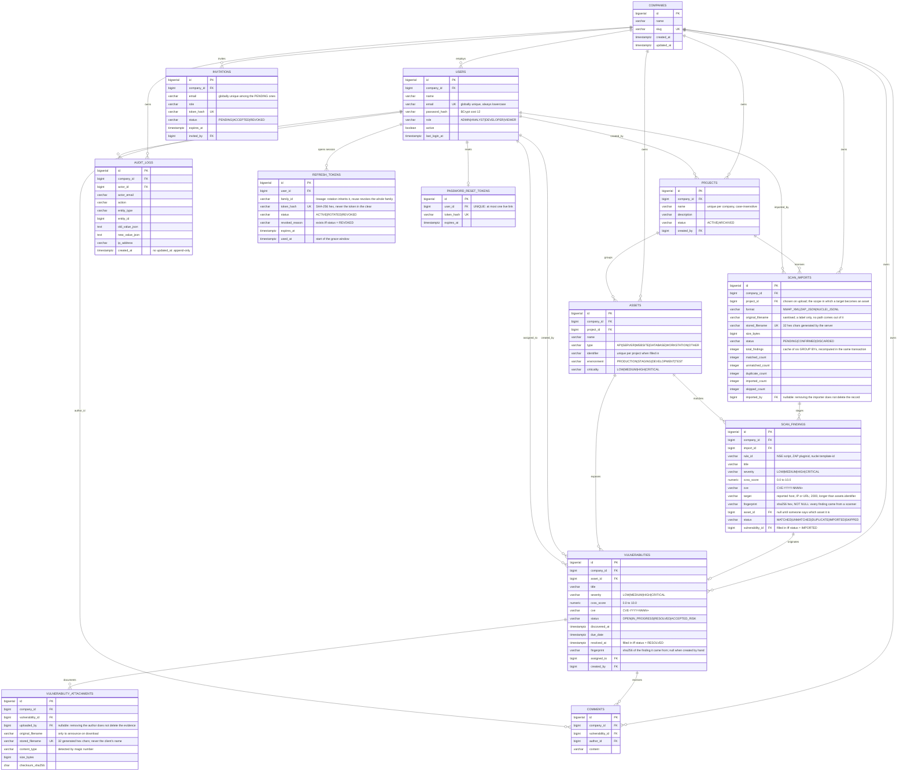

# Data model

Schema versioned with Flyway in `backend/src/main/resources/db/migration`. Hibernate runs with
`ddl-auto: validate`: the database is created exclusively by the migrations, and a divergence
between entity and schema brings the application down at boot instead of silently correcting
it.

| Migration | Tables |
| --- | --- |
| `V1__companies_and_users.sql` | `companies`, `users` |
| `V2__audit_logs.sql` | `audit_logs` |
| `V3__projects.sql` | `projects` |
| `V4__assets.sql` | `assets` |
| `V5__vulnerabilities_and_comments.sql` | `vulnerabilities`, `comments` |
| `V6__dashboard_indexes.sql` | indexes for the dashboard aggregations |
| `V7__identity_core.sql` | `refresh_tokens`, `password_reset_tokens`, `invitations` |
| `V8__vulnerability_attachments.sql` | `vulnerability_attachments` |
| `V9__scan_imports.sql` | `scan_imports`, `scan_findings`, `vulnerabilities.fingerprint` |

## ER diagram



## Modelling decisions

### An applied migration is frozen, comments included

Flyway checksums the whole file, so editing a migration that some database has already run
makes that database refuse to start — the crash loop the comment in `V6` warns about.

This bit during the pass that put the repository into English: translating the comments of
`V6`, `V7`, `V9` and `V10` changed their checksums, and every stack that had already come up
stopped booting with `Migration checksum mismatch`. The test suite could not catch it, because
Testcontainers builds an empty database on every run and has nothing to validate against.

Those four files therefore keep their original Portuguese comments. It is a deliberate
exception to the language rule, and a cheaper one than either asking people to run
`flyway repair` or leaving an upgrade path that breaks. A new migration is always the answer;
`V10` exists for exactly that reason.

### `company_id` is denormalised in every domain table
`assets`, `vulnerabilities` and `comments` could reach the company by navigating to the parent,
but they carry the column. Every domain query filters by company; forcing a join just to reach
the tenant would put that join on the hot path of everything. The denormalisation is safe
because **a row's tenant never changes**: the associations are mapped with `updatable = false`.

### `project_id` is **not** denormalised in `vulnerabilities`
Unlike the tenant, an asset's project **does** change: an ADMIN can move an asset between
projects of the same company. A denormalised column would go stale and would require a cascading
update on every move, with the asset module coming to depend on the vulnerability module on
write. The project is read through `asset.project` — and the listing already performs that join
to display `projectName`, so the filter does not cost an extra join.

### Enums as `VARCHAR` + `CHECK`, not PostgreSQL enum types
Adding a value to a native enum type is DDL that does not run inside a transaction on every
version, and the Hibernate mapping is more fragile. `VARCHAR` with a `CHECK` validates in the
database, is readable from any SQL client and evolves with an `ALTER ... DROP/ADD CONSTRAINT`.

### No foreign key uses `ON DELETE CASCADE`
The product rule requires a conflict when deleting a parent that still has children, not a
silent cascading delete. The rule lives in the service (`ensureNoChildren` → 409) and the
absence of a cascade in the database is the safety net: a forgotten path becomes an integrity
error, not silent data loss.

The one deliberate exception is `comments` when deleting a vulnerability: no endpoint deletes a
comment, so a 409 would make any commented vulnerability permanently undeletable. Comments are
removed explicitly in Java and the count is recorded in the audit snapshot.

### `resolved_at` is tied to the status by the database
`CHECK ((status = 'RESOLVED') = (resolved_at IS NOT NULL))`. The rule is applied in the service,
but a future defect cannot persist an inconsistent row.

### Indexes always start with `company_id`
It is the predicate present in 100% of the domain queries, so it leads every composite index.
Three indexes are partial because they reflect exactly the predicate they serve:
`(company_id, assigned_to) WHERE assigned_to IS NOT NULL`,
`(company_id, due_date) WHERE status IN ('OPEN','IN_PROGRESS')` and, since V9,
`(company_id, fingerprint) WHERE fingerprint IS NOT NULL` — the last one unique, and explained
further down.

### Case-insensitive uniqueness by expression
`projects (company_id, lower(name))` and `assets (project_id, lower(identifier)) WHERE identifier IS NOT NULL`.
The partial index is what allows several assets without an identifier in the same project,
instead of treating all the nulls as a collision.

### Credential material is stored as SHA-256, and the database refuses anything else

The three V7 tables store only the hexadecimal digest, under
`CHECK (token_hash ~ '^[0-9a-f]{64}$')`. If someone ever tries to store the token in the clear,
the row does not go in. SHA-256 and not BCrypt: the input is 256 bits of CSPRNG, it is not a
human password, and the slow hash would be not only useless but **unsearchable** — finding the
row for a token would mean comparing against every row of that user.

### `refresh_tokens` has no `company_id`

It is the only exception to the rule that every domain table carries the tenant. This table is
never queried by company: every access is by `token_hash`, `user_id` or `family_id`. The company
comes from `users`, which is the authoritative source and cannot diverge. Denormalising here
would create a second copy of a fact the foreign key already carries.

### `family_id` is `VARCHAR(36)` and not `uuid`

Hibernate 5.6 maps `java.util.UUID` as `uuid-binary` by default, which would fail under
`ddl-auto: validate` against a `uuid` column unless the entity carried `@Type("pg-uuid")`.
Storing the text removes the trap and is readable in `psql`.

### `password_reset_tokens` has no usage column

"Single use", "invalidated when the password changes" and "at most one live link" collapse into
a `DELETE` plus a `UNIQUE (user_id)`. A state machine here would be complexity to keep history
that the audit trail already keeps.

### An invitation is not a `users` row

Recorded in `docs/permissions.md`: an ADMIN invitation that is never accepted would count toward
the last-active-administrator rule. It would also appear as a possible vulnerability assignee
and would burn the address against the global unique constraint with no way to release it.

### An attachment separates the client's name from the name on disk

`stored_filename` is generated and validated by a regex in the database itself;
`original_filename` is sanitised and serves only to announce the name on download. They are two
independent layers, and neither depends on the other to prevent path traversal.

### Finding deduplication is an index, not a promise from the service

`vulnerabilities.fingerprint` stores `sha256hex(scanner:ruleId:target:cve)` of the finding that
originated the row, and

```sql
CREATE UNIQUE INDEX uk_vulnerabilities_company_fingerprint
    ON vulnerabilities (company_id, fingerprint)
    WHERE fingerprint IS NOT NULL;
```

is what makes "the same company never imports the same finding twice" a database guarantee.
`ScanImportService` also skips duplicates — and checks again on confirmation, because an import
staged yesterday may be confirmed after another one has already created the same row — but that
is the layer a second importer, a future batch endpoint or two concurrent confirmations would
forget. The second insert fails, and it fails for whoever writes it.

The index is **partial** because the column is null on every hand-created vulnerability: without
the `WHERE`, a company's second manual vulnerability would collide with the first on a shared
NULL in the engines that treat nulls as equal, and would inflate the index with rows that will
never be queried in the ones that do not.

### The fingerprint includes neither severity nor CVSS

What goes into it is what makes a finding the same finding on the next scan: which scanner
spoke, which rule fired, where, and about which CVE. Severity and score do **not** go in, and
the omission is the decision: vendors re-score their own rules between versions, and a template
that said `medium` last month says `high` today for the same defect on the same host. Including
them would make every re-scan after such a change import a second copy of something that already
has an owner, a status and a discussion — and the first copy would never be closed.

A null component contributes empty but keeps the separator, so a finding without a CVE remains
distinguishable from one whose CVE is the empty string.

### `project_id` **is** denormalised in `scan_imports`

This is the opposite of the decision about `vulnerabilities`, and by the same criterion. An
asset's project changes — which is why it is not copied to the vulnerability. An import's
project does not change: it is the project the operator chose on upload, and it is the scope in
which each target was looked for. That is a historical fact, not a copy that can go stale.

### The six `scan_imports` counters are a cache, and they are recomputed

`total_findings` and the five per-status counters are the aggregation of `scan_findings`. They
exist because the history shows all six on every row, and reading them from the findings would
make a page of twenty imports twenty aggregate queries. The service **recomputes** them from the
rows — never increments — inside the same transaction that changes a finding's status, so the
cache and the data it summarises commit together or not at all. A `CHECK` refuses a negative
counter, which is how a defect in the recomputation shows up early instead of becoming
"-1 duplicate findings" on screen.

### The finding keeps the traceability the audit trail does not

Confirmation writes **one** audit row (`SCAN_IMPORT`) with the counters, not one `CREATE` per
vulnerability: hundreds of identical rows would bury the company's trail, and `AuditService`
truncates the JSON at 8000 characters, so a summary that grew with the size of the report would
be cut in the middle. The question "where did this vulnerability come from" is answered by
`scan_findings.vulnerability_id`, which is queryable, joins with the rest and is scoped to the
import.

### `users.email` is globally unique
Decision recorded in `docs/adr/0004`: the domain model asks for uniqueness per company, but the
login contract defines `POST /auth/login` with no company discriminator. Global uniqueness is
strictly stronger and makes login deterministic.
