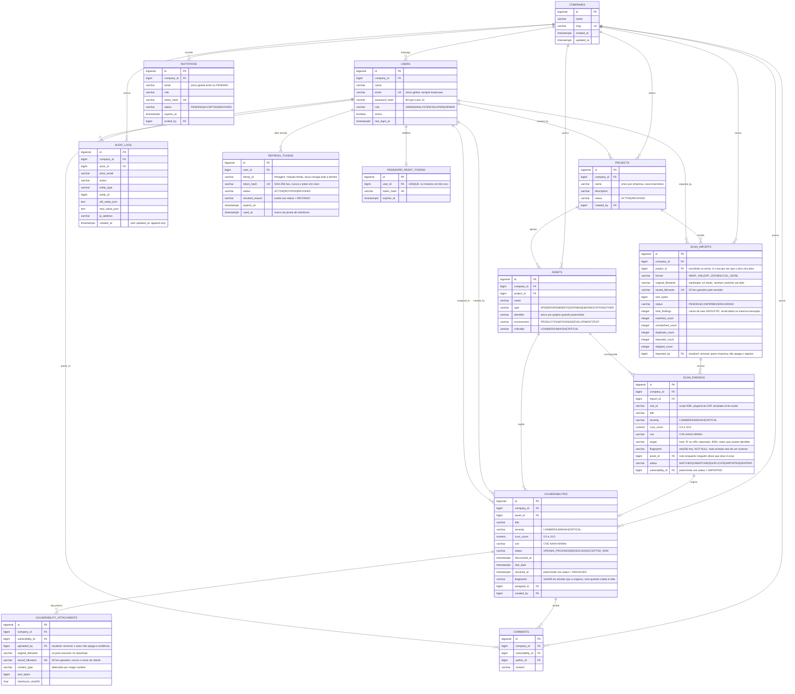

# Modelo de dados

Schema versionado com Flyway em `backend/src/main/resources/db/migration`. O Hibernate roda
com `ddl-auto: validate`: o banco é criado exclusivamente pelas migrations, e uma divergência
entre entidade e schema derruba a aplicação no boot em vez de corrigir silenciosamente.

| Migration | Tabelas |
| --- | --- |
| `V1__companies_and_users.sql` | `companies`, `users` |
| `V2__audit_logs.sql` | `audit_logs` |
| `V3__projects.sql` | `projects` |
| `V4__assets.sql` | `assets` |
| `V5__vulnerabilities_and_comments.sql` | `vulnerabilities`, `comments` |
| `V6__dashboard_indexes.sql` | índices das agregações do dashboard |
| `V7__identity_core.sql` | `refresh_tokens`, `password_reset_tokens`, `invitations` |
| `V8__vulnerability_attachments.sql` | `vulnerability_attachments` |
| `V9__scan_imports.sql` | `scan_imports`, `scan_findings`, `vulnerabilities.fingerprint` |

## DER



## Decisões de modelagem

### `company_id` é denormalizado em toda tabela de domínio
`assets`, `vulnerabilities` e `comments` poderiam chegar à empresa navegando pelo pai, mas
carregam a coluna. Toda consulta de domínio filtra por empresa; obrigar um join só para
alcançar o tenant colocaria esse join no caminho quente de tudo. A denormalização é segura
porque **o tenant de uma linha nunca muda**: as associações são mapeadas com
`updatable = false`.

### `project_id` **não** é denormalizado em `vulnerabilities`
Ao contrário do tenant, o projeto de um ativo **muda**: um ADMIN pode mover um ativo entre
projetos da mesma empresa. Uma coluna denormalizada ficaria obsoleta e exigiria atualização
em cascata a cada movimentação, com o módulo de ativos passando a depender do de
vulnerabilidades na escrita. O projeto é lido por `asset.project` — e a listagem já faz esse
join para exibir `projectName`, então o filtro não custa um join extra.

### Enums como `VARCHAR` + `CHECK`, não tipos enum do PostgreSQL
Adicionar um valor a um tipo enum nativo é DDL que não roda dentro de transação em todas as
versões, e o mapeamento do Hibernate fica mais frágil. `VARCHAR` com `CHECK` valida no banco,
é legível em qualquer cliente SQL e evolui com um `ALTER ... DROP/ADD CONSTRAINT`.

### Nenhuma FK usa `ON DELETE CASCADE`
A regra do produto exige conflito ao excluir um pai que ainda tem filhos, e não apagar em cascata
silenciosamente. A regra vive no serviço (`ensureNoChildren` → 409) e a ausência de cascata
no banco é a rede de segurança: um caminho esquecido vira erro de integridade, não perda
silenciosa de dados.

A única exceção deliberada é `comments` ao excluir uma vulnerabilidade: não existe endpoint
que apague um comentário, então um 409 tornaria qualquer vulnerabilidade comentada
permanentemente indeletável. Os comentários são removidos explicitamente em Java e a
quantidade é registrada no snapshot de auditoria.

### `resolved_at` é amarrado ao status pelo banco
`CHECK ((status = 'RESOLVED') = (resolved_at IS NOT NULL))`. A regra é
aplicada no serviço, mas um defeito futuro não consegue persistir uma linha inconsistente.

### Índices sempre começam por `company_id`
É o predicado presente em 100% das consultas de domínio, então lidera todo índice composto.
Três índices são parciais por refletirem exatamente o predicado que servem:
`(company_id, assigned_to) WHERE assigned_to IS NOT NULL`,
`(company_id, due_date) WHERE status IN ('OPEN','IN_PROGRESS')` e, desde a V9,
`(company_id, fingerprint) WHERE fingerprint IS NOT NULL` — este último único, e explicado
adiante.

### Unicidade case-insensitive por expressão
`projects (company_id, lower(name))` e `assets (project_id, lower(identifier)) WHERE identifier IS NOT NULL`.
O índice parcial é o que permite vários ativos sem identificador no mesmo projeto, em vez de
tratar todos os nulos como colisão.

### Material de credencial é guardado como SHA-256, e o banco recusa outra coisa

As três tabelas da V7 guardam apenas o digest hexadecimal, sob
`CHECK (token_hash ~ '^[0-9a-f]{64}$')`. Se um dia alguém tentar gravar o token em claro, a
linha não entra. SHA-256 e não BCrypt: a entrada tem 256 bits de CSPRNG, não é senha humana, e
o hash lento seria além de inútil **imbuscável** — encontrar a linha de um token exigiria
comparar contra todas as do usuário.

### `refresh_tokens` não tem `company_id`

É a única exceção à regra de que toda tabela de domínio carrega o tenant. Esta tabela nunca é
consultada por empresa: todo acesso é por `token_hash`, `user_id` ou `family_id`. A empresa vem
de `users`, que é a fonte autoritativa e não pode divergir. Denormalizar aqui criaria uma
segunda cópia de um fato que a chave estrangeira já carrega.

### `family_id` é `VARCHAR(36)` e não `uuid`

O Hibernate 5.6 mapeia `java.util.UUID` como `uuid-binary` por padrão, o que falharia no
`ddl-auto: validate` contra uma coluna `uuid` a menos que a entidade carregasse
`@Type("pg-uuid")`. Guardar o texto elimina a armadilha e é legível no `psql`.

### `password_reset_tokens` não tem coluna de uso

"Uso único", "invalidado ao trocar a senha" e "no máximo um link vivo" colapsam num `DELETE`
mais um `UNIQUE (user_id)`. Uma máquina de estados aqui seria complexidade para guardar
histórico que a trilha de auditoria já guarda.

### O convite não é uma linha de `users`

Registrado em `docs/permissions.md`: um convite de ADMIN nunca aceito contaria na regra do
último administrador ativo. Também apareceria como responsável possível de vulnerabilidade e
queimaria o endereço contra o único global sem forma de liberar.

### O anexo separa o nome do cliente do nome em disco

`stored_filename` é gerado e validado por regex no próprio banco; `original_filename` é
sanitizado e serve apenas para anunciar no download. São duas camadas independentes, e nenhuma
depende da outra para impedir travessia de caminho.

### A deduplicação de achados é um índice, não uma promessa do serviço

`vulnerabilities.fingerprint` guarda `sha256hex(scanner:ruleId:target:cve)` do achado que
originou a linha, e

```sql
CREATE UNIQUE INDEX uk_vulnerabilities_company_fingerprint
    ON vulnerabilities (company_id, fingerprint)
    WHERE fingerprint IS NOT NULL;
```

é o que torna "a mesma empresa nunca importa o mesmo achado duas vezes" uma garantia do banco.
`ScanImportService` também pula duplicados — e checa de novo na confirmação, porque uma
importação encenada ontem pode ser confirmada depois de outra já ter criado a mesma linha —,
mas essa é a camada que um segundo importador, um endpoint em lote futuro ou duas confirmações
concorrentes esqueceriam. A segunda inserção falha, e falha para quem quer que a escreva.

O índice é **parcial** porque a coluna é nula em toda vulnerabilidade criada à mão: sem o
`WHERE`, a segunda vulnerabilidade manual de uma empresa colidiria com a primeira num NULL
compartilhado nos motores que tratam nulos como iguais, e inflaria o índice com linhas que
nunca serão consultadas nos que não tratam.

### A impressão digital não inclui severidade nem CVSS

O que entra nela é o que faz um achado ser o mesmo achado na varredura seguinte: qual scanner
falou, que regra disparou, onde, e sobre qual CVE. Severidade e nota **não** entram, e a
omissão é a decisão: fabricantes re-pontuam as próprias regras entre versões, e um template que
dizia `medium` no mês passado diz `high` hoje para o mesmo defeito no mesmo host. Incluí-las
faria cada re-scan depois de uma mudança dessas importar uma segunda cópia de algo que já tem
dono, status e discussão — e a primeira cópia nunca fecharia.

Um componente nulo contribui vazio mas mantém o separador, então um achado sem CVE continua
distinguível de um cujo CVE é a string vazia.

### `project_id` **é** denormalizado em `scan_imports`

É o oposto da decisão sobre `vulnerabilities`, e pelo mesmo critério. O projeto de um ativo
muda — por isso não é copiado para a vulnerabilidade. O projeto de uma importação não muda:
é o projeto que o operador escolheu no envio, e é o escopo em que cada alvo foi procurado.
Isso é um fato histórico, não uma cópia que pode ficar obsoleta.

### Os seis contadores de `scan_imports` são cache, e são recalculados

`total_findings` e os cinco contadores por situação são a agregação de `scan_findings`. Existem
porque o histórico mostra os seis em toda linha, e lê-los dos achados faria de uma página de
vinte importações vinte consultas agregadas. O serviço os **recalcula** a partir das linhas —
nunca incrementa — dentro da mesma transação que muda a situação de um achado, então o cache e
os dados que ele resume commitam juntos ou não commitam. Um `CHECK` recusa contador negativo,
que é como um defeito no recálculo aparece cedo em vez de virar "-1 achados duplicados" na tela.

### O achado guarda a rastreabilidade que a auditoria não guarda

A confirmação escreve **uma** linha de auditoria (`SCAN_IMPORT`) com os contadores, e não uma
`CREATE` por vulnerabilidade: centenas de linhas idênticas enterrariam a trilha da empresa, e
`AuditService` trunca o JSON em 8000 caracteres, então um resumo que crescesse com o tamanho do
relatório seria cortado no meio. A pergunta "de onde veio esta vulnerabilidade" é respondida por
`scan_findings.vulnerability_id`, que é consultável, junta com o resto e está escopado à
importação.

### `users.email` é único globalmente
Decisão registrada em `docs/adr/0004`: o modelo de domínio pede unicidade por empresa, mas o contrato de login
define `POST /auth/login` sem discriminador de empresa. Unicidade global é estritamente mais
forte e torna o login determinístico.
