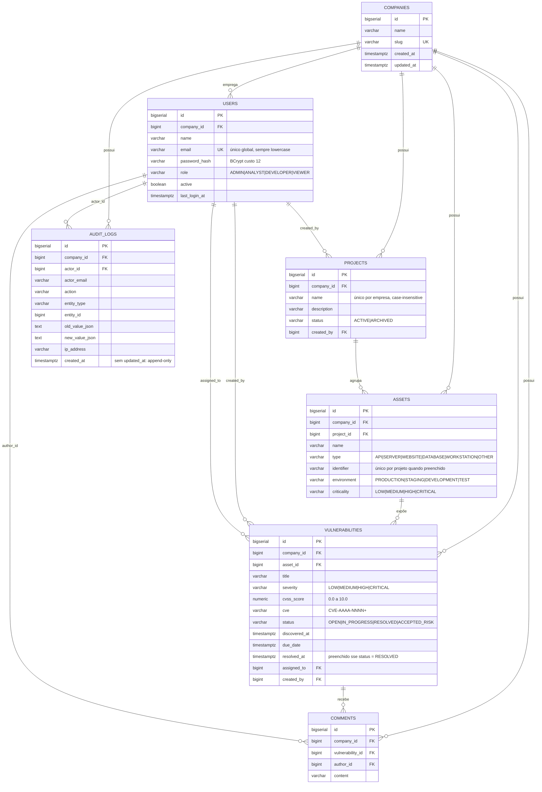

# Modelo de dados

Schema versionado com Flyway em `backend/src/main/resources/db/migration`. O Hibernate roda
com `ddl-auto: validate`: o banco é criado exclusivamente pelas migrations, e uma divergência
entre entidade e schema derruba a aplicação no boot em vez de corrigir silenciosamente.

| Migration | Tabelas |
| --- | --- |
| `V1__companies_and_users.sql` | `companies`, `users` |
| `V2__audit_logs.sql` | `audit_logs` |
| `V3__projects.sql` | `projects` |
| `V4__assets.sql` | `assets` |
| `V5__vulnerabilities_and_comments.sql` | `vulnerabilities`, `comments` |

## DER

## Decisões de modelagem

### `company_id` é denormalizado em toda tabela de domínio
`assets`, `vulnerabilities` e `comments` poderiam chegar à empresa navegando pelo pai, mas
carregam a coluna. Toda consulta de domínio filtra por empresa; obrigar um join só para
alcançar o tenant colocaria esse join no caminho quente de tudo. A denormalização é segura
porque **o tenant de uma linha nunca muda**: as associações são mapeadas com
`updatable = false`.

### `project_id` **não** é denormalizado em `vulnerabilities`
Ao contrário do tenant, o projeto de um ativo **muda**: um ADMIN pode mover um ativo entre
projetos da mesma empresa. Uma coluna denormalizada ficaria obsoleta e exigiria atualização
em cascata a cada movimentação, com o módulo de ativos passando a depender do de
vulnerabilidades na escrita. O projeto é lido por `asset.project` — e a listagem já faz esse
join para exibir `projectName`, então o filtro não custa um join extra.

### Enums como `VARCHAR` + `CHECK`, não tipos enum do PostgreSQL
Adicionar um valor a um tipo enum nativo é DDL que não roda dentro de transação em todas as
versões, e o mapeamento do Hibernate fica mais frágil. `VARCHAR` com `CHECK` valida no banco,
é legível em qualquer cliente SQL e evolui com um `ALTER ... DROP/ADD CONSTRAINT`.

### Nenhuma FK usa `ON DELETE CASCADE`
A regra do produto exige conflito ao excluir um pai que ainda tem filhos, e não apagar em cascata
silenciosamente. A regra vive no serviço (`ensureNoChildren` → 409) e a ausência de cascata
no banco é a rede de segurança: um caminho esquecido vira erro de integridade, não perda
silenciosa de dados.

A única exceção deliberada é `comments` ao excluir uma vulnerabilidade: não existe endpoint
que apague um comentário, então um 409 tornaria qualquer vulnerabilidade comentada
permanentemente indeletável. Os comentários são removidos explicitamente em Java e a
quantidade é registrada no snapshot de auditoria.

### `resolved_at` é amarrado ao status pelo banco
`CHECK ((status = 'RESOLVED') = (resolved_at IS NOT NULL))`. A regra é
aplicada no serviço, mas um defeito futuro não consegue persistir uma linha inconsistente.

### Índices sempre começam por `company_id`
É o predicado presente em 100% das consultas de domínio, então lidera todo índice composto.
Dois índices são parciais por refletirem exatamente o predicado que servem:
`(company_id, assigned_to) WHERE assigned_to IS NOT NULL` e
`(company_id, due_date) WHERE status IN ('OPEN','IN_PROGRESS')`.

### Unicidade case-insensitive por expressão
`projects (company_id, lower(name))` e `assets (project_id, lower(identifier)) WHERE identifier IS NOT NULL`.
O índice parcial é o que permite vários ativos sem identificador no mesmo projeto, em vez de
tratar todos os nulos como colisão.

### `users.email` é único globalmente
Decisão registrada em `docs/adr/0004`: o modelo de domínio pede unicidade por empresa, mas o contrato de login
define `POST /auth/login` sem discriminador de empresa. Unicidade global é estritamente mais
forte e torna o login determinístico.
